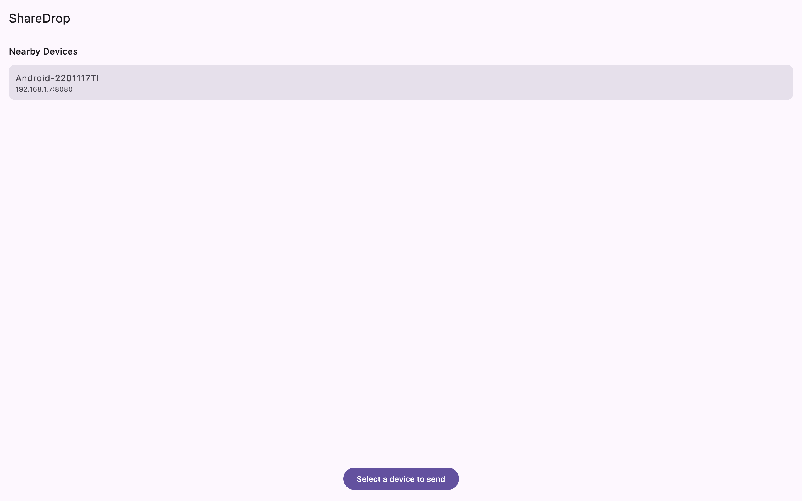
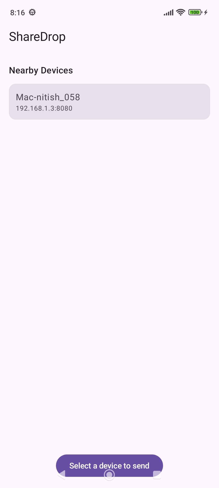
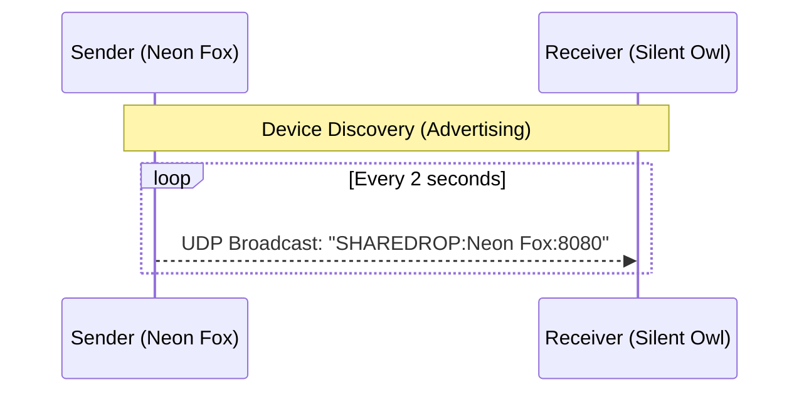
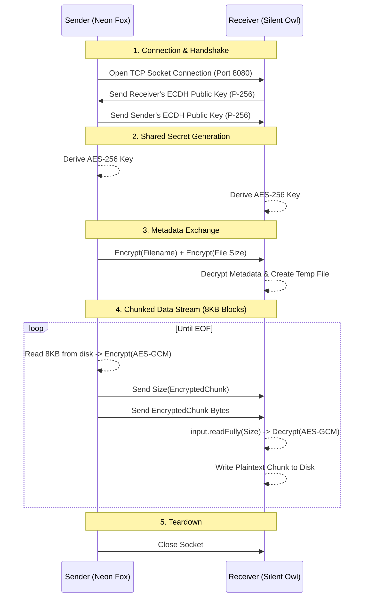

# ShareDrop

ShareDrop is a local file sharing app that works across Android, Mac, Windows, Linux, iOS, and Web. No internet, no account, no cloud — just connect to the same WiFi and share files directly between your devices.

It's built with Kotlin Multiplatform and Compose Multiplatform, so most of the code is written once and runs everywhere.

---

## Download

### Latest Version

| Platform | Download |
| :------- | :------- |
| Android | [](https://github.com/nitish058/sharedrop/releases/latest/download/sharedrop.apk) |
| macOS | [](https://github.com/nitish058/sharedrop/releases/latest/download/sharedrop.dmg) |
| Windows | [](https://github.com/nitish058/sharedrop/releases/latest/download/sharedrop.exe) |
| Linux | [](https://github.com/nitish058/sharedrop/releases/latest/download/sharedrop.deb) |

[View All Releases](https://github.com/nitish058/sharedrop/releases) for additional builds and older versions.

## Screenshots

| Desktop                                               | Android                                                   |
| ----------------------------------------------------- | --------------------------------------------------------- |
|  |  |

---

## Why I built this

I wanted to send files between my Mac and Android phone without using Google Drive or a USB cable every time. Existing apps either required an account or felt overly complicated for something this simple. So I built ShareDrop as a learning project while exploring Kotlin Multiplatform — and it actually works.

---

## How It Works

ShareDrop operates entirely peer-to-peer. Nothing goes through a central server or the internet; the two devices talk directly to each other over your local network.

The process is divided into two distinct phases: Discovery (Advertising) and Secure File Transfer.

### 1. Device Discovery (Advertising)

Discovery is completely decentralized. Every device running the app sends a small UDP broadcast packet every 2 seconds. Any other device on the same network listening on port 8888 picks it up, parses the payload, and displays that device in the available peers list.



### 2. Secure File Transfer

Once you select a device and pick a file, the app opens a direct TCP connection to that device on port 8080. To guarantee End-to-End Encryption (E2EE) and maintain a tiny memory footprint, the file is never loaded fully into RAM. Instead, it relies on a **Chunk-by-Chunk Encryption/Decryption** stream.

#### Security Specifications

- **Key Exchange:** Elliptic-Curve Diffie-Hellman (ECDH) over the NIST P-256 curve.
- **Symmetric Encryption:** AES-256-GCM (Galois/Counter Mode).
- **Integrity:** Implicit Initialization Vector (IV) and built-in MAC authentication tags to prevent payload tampering.

#### Protocol Flow (Handshake & Transfer)



#### Memory Efficiency (`OOM` Prevention)

Encrypting an entire file at once requires allocating `FileSize + CipherOverhead` bytes in RAM. For mobile platforms like Android, this guarantees an application crash for large payloads.

ShareDrop solves this by:

1. Slicing the file into strictly sized **8192-byte chunks**.
2. Encrypting and transmitting one chunk at a time.
3. Prepending the exact `Int` size of the upcoming encrypted payload (since AES-GCM adds a ~28 byte overhead for the implicit Nonce and MAC Tag).
4. Using `DataInputStream.readFully()` on the receiving device to guarantee the exact AES block is buffered before attempting decryption. This prevents `AEADBadTagException` crashes caused by network desynchronization or fragmented TCP packets.

#### Supported platforms

| Platform          | E2EE Implemented | Tested |
| :---------------- | :--------------: | :----: |
| **Android**       |       Yes        |  Yes   |
| **Windows** (JVM) |       Yes        |  Yes   |
| **Linux** (JVM)   |       WIP        |   No   |
| **macOS** (JVM)   |       WIP        |   No   |
| **iOS**           |        No        |   No   |

_(Legend: = Fully Working & Tested | = Work In Progress / Untested | = Not Supported Yet)_

---

## Platform support

| Platform | Status      |
| -------- | ----------- |
| Android  | Working     |
| macOS    | Working     |
| Windows  | Working     |
| Linux    | Working     |
| iOS      | In progress |
| Web      | In progress |

Desktop (Mac, Windows, Linux) all run through the same JVM target, so if it works on one it works on all three.

---

## Tech stack

- Kotlin Multiplatform
- Compose Multiplatform
- UDP sockets for device discovery
- TCP sockets for file transfer
- No third party networking libraries

---

## Getting started

### What you need

- Android Studio (latest version)
- Xcode 15 or later (only needed for iOS or macOS builds)
- JDK 17 or higher
- Kotlin Multiplatform plugin in Android Studio

### Clone and open

```bash
git clone https://github.com/nitish058/ShareDrop.git
cd ShareDrop
```

Open the project in Android Studio and let Gradle sync finish.

### Run on Desktop (Mac, Windows, Linux)

Create a run configuration in Android Studio:

- Type: Gradle
- Name: Desktop
- Run: `hotRunJvm -DmainClass=org.nitish.project.sharedrop.MainKt`
- Gradle project: ShareDrop (root)

Hit Run.

### Run on Android

Either run directly from Android Studio with a connected device, or build manually:

```bash
./gradlew assembleDebug
adb install -r composeApp/build/outputs/apk/debug/composeApp-debug.apk
```

Both devices need to be on the same WiFi network for discovery to work.

---

## Project structure

```
ShareDrop/
├── composeApp/
│   └── src/
│       ├── commonMain/       # Shared code — UI, interfaces, data models
│       │   └── kotlin/
│       │       ├── App.kt
│       │       ├── DeviceDiscovery.kt
│       │       ├── DeviceAdvertiser.kt
│       │       ├── FileReceiver.kt
│       │       ├── FileSender.kt
│       │       ├── FilePicker.kt
│       │       └── FileSaver.kt
│       ├── androidMain/      # Android implementations
│       ├── jvmMain/          # Desktop implementations (Mac, Windows, Linux)
│       ├── iosMain/          # iOS (work in progress)
│       ├── jsMain/           # Web JS (work in progress)
│       └── wasmJsMain/       # WebAssembly (work in progress)
└── iosApp/                   # iOS app entry point
```

The pattern used throughout is Kotlin's `expect/actual` — `commonMain` defines what each feature should do, and each platform folder provides the actual implementation. This keeps platform-specific code isolated and the shared code clean.

---

## Known issues

- Both devices must be on the same WiFi network. It won't work over mobile data or across different networks.
- iOS and Web are not fully working yet.
- Very large files may be slow depending on your network.

---

## Roadmap

- Send multiple files at once
- iOS support
- Web support
- Choose where received files are saved
- Send text/clipboard content directly

---

## Contributing

If you want to contribute, you're welcome to. The codebase is relatively small and easy to navigate.

Good places to start:

- Implement iOS discovery using the Network framework or Bonjour
- Add a screen that shows transfer history
- Dark mode
- Any of the items in the roadmap above

To contribute:

1. Fork the repo
2. Create a branch: `git checkout -b feature/what-youre-adding`
3. Make your changes and test on at least one platform
4. Open a pull request with a clear description of what you changed and why

For bigger changes, open an issue first so we can discuss before you spend time on it.

## Community

Join the **ShareDrop Discord server** for:

- contributor discussions
- bug reports
- feature ideas
- PR reviews
- testing updates

[Join the ShareDrop Discord Server](https://discord.gg/vJxAn2BeXB)

---

## Author

Nitish — [github.com/nitish058](https://github.com/nitish058)

---

## License

MIT — see [LICENSE](LICENSE) for details.
